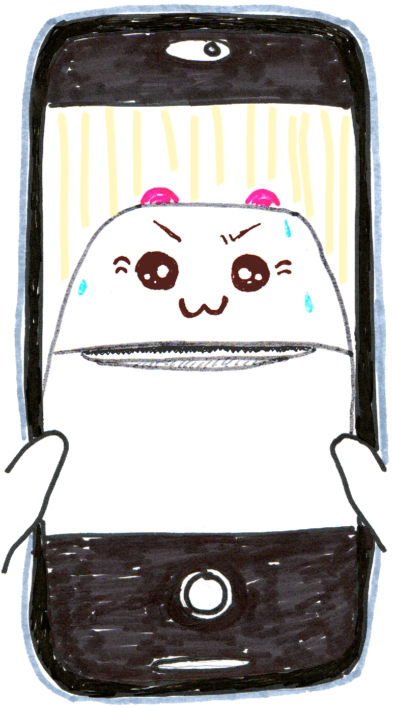

You catch a glance of yourself on the reflection of your phone screen 

Are you imagining things…?

You open your camera app in selfie mode like a mirror

  

no

NO!!!!!

it’s what you feared

<strong>YOU HAVE TURNED INTO A RECEIPT PRINTER</strong>

How this happened,  you have no clue  Why this happened...  you have a guess 

A few moments ago you had been coloring in a zine.   You were coloring a picture of a QR code, and as you colored you had this thought:

<blockquote>
It’s like <em>I’m</em> a receipt printer now! I'm a human printer printing a qr code hehe
</blockquote>

And as you colored you grew increasingly consumed by this thought

Wow, life as a printer...  it’s not so bad. 

I like coloring…  Relaxing… 

what if I was reborn a printer haha.... 

I would grant people's wishes all day... as long as their wish was a printout

like a genie... to live as a genie...

I liked Aladdin…

It seems some cosmic genie eavesdropped on your heart and granted this wish of yours!!!!!!

You put your phone down (err not <em>you</em>, reader)

You close your eyes. 

For now you must decide

YOU ARE A RECEIPT PRINTER

DO YOU ACCEPT THIS FATE?

<button id="yes">yes I am PRINTER</button>
<button id="no">NO! I AM NOT PRINTER</button>

